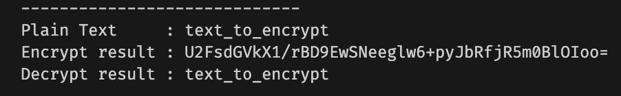

## Experiment Project - Cryptography Implementation

Experiment project for impementation cryptography. 

Cryptography is technique of securing information and communications through use of codes so that only those person for whom the information is intended can understand it and process it.

---

The example is **AES** encryption. How to test, run in your workspace:

First:

```
npm install 
```


Then, change text to encrypt and secreate key in (example) `aes.test.ts`


Finally run:

```
node src/aes.test.ts
```

---

After you run client script, it will show like below:


---

If you want more information just hit me up. :)

Description reference:

- https://www.geeksforgeeks.org/cryptography-and-its-types/